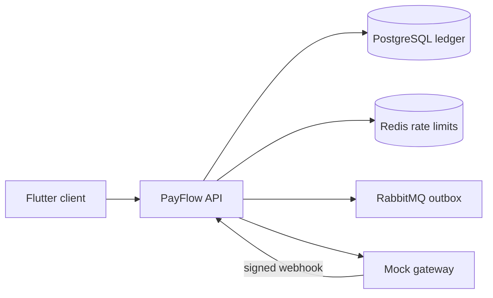

# PayFlow

Wallet and payments **simulation**. It never handles real card data or real money. Amounts are integer paise (`long`), currency INR.

The backend covers SPEC phases 1–7: auth, ledger, transfers, locking, idempotency, the mock gateway, top-ups, merchant payments, refunds, reconciliation, audit, and admin APIs. The Flutter client in `mobile/` covers auth, wallet, send, top-up, history, merchant QR, scan-and-pay, and the admin checks.

## Run locally

Docker is required for Postgres, Redis, RabbitMQ, and the integration tests.

```bash
docker compose up --build
```

- API: http://localhost:8080
- Swagger: http://localhost:8080/swagger-ui.html
- Gateway pay page: http://localhost:8081
- RabbitMQ management: http://localhost:15672 (`guest` / `guest`)

Seeded admin (Flyway V2, local only): `admin@payflow.local` / `admin-dev-change-me`.

To run the API on the host instead of in Compose, start `postgres`, `redis`, `rabbitmq`, and `gateway`, then:

```bash
cd backend
./mvnw spring-boot:run
```

On Windows use `mvnw.cmd`. The default profile is `local`. `prod` reads `DATABASE_URL`, `DATABASE_USERNAME`, and `DATABASE_PASSWORD`.

The Flutter app expects the API at `http://localhost:8080`. From `mobile`:

```bash
flutter pub get
flutter run -d chrome
```

On Windows, if `flutter` is not on `PATH`, use the full path to `flutter.bat`. Chrome is the straightforward local client. A Windows desktop build needs Developer Mode so Flutter can create plugin symlinks.

## Architecture



A transfer locks both accounts in ascending id order, posts ledger legs that sum to zero, and completes the idempotency key in that same transaction. A top-up calls the gateway only after that short transaction commits. If the gateway captured the money and the process died, the recovery job or a later webhook credits the wallet once.

At about 10k transfers per second a single Postgres primary becomes the write bottleneck. Hot accounts serialize on one row lock, and the audit chain serializes every append. The next steps would be to shard by account id, keep a partitioned ledger, serve history from replicas, and publish the outbox with the database log instead of a poll.

## Load and chaos

`scripts/load/transfers.js` is a k6 script for concurrent transfers. It does not contain measured RPS or latency; run it against a funded pair of users and record the k6 summary yourself. `scripts/chaos-demo.ps1` turns the gateway's timeout, duplicate, and drop rates up, then asks the admin integrity endpoint whether the ledger still balances, and turns chaos back off.

## Tests

```bash
cd backend
./mvnw test                                           # unit tests, no Docker
./mvnw -f ../gateway/pom.xml test                     # mock gateway (H2)
./mvnw verify                                         # unit + Testcontainers Postgres 16 and Redis 7
cd ../mobile && flutter test                          # money parsing, idempotency header, send-money widgets
```

`PayflowBehaviorIT` covers transfers, the 50-way idempotent replay, key reuse, cursor pagination, 100 concurrent transfers, A↔B / B↔A 1000 times each way, duplicate and out-of-order webhooks, bad signatures, saga recovery, double QR payment, a full refund, reconciliation auto-fix, integrity and audit tamper detection, the ledger append-only trigger, the Redis token bucket, and admin login.

## Money movement

Every completed movement posts balanced ledger legs (signed sum zero). User balances cannot go negative; the system gateway account can, because it is the source of top-up funds. `ledger_entries` rejects UPDATE and DELETE. Account locks are taken in ascending UUID order. The gateway HTTP call sits outside the transaction that holds those locks.

Money-moving POSTs require `Idempotency-Key` (8–100 characters). The same key and body replay the stored response. A different body returns `409 IDEMPOTENCY_KEY_REUSED`. A business failure such as insufficient balance rolls the key back, so the same key can be retried after the user tops up.

Outbox publishing defaults to in-process consumers. Compose sets `PAYFLOW_OUTBOX_BROKER=rabbit`, which publishes to the `payflow.events` exchange.

## Not in this tree

- Measured k6 numbers (the script is in `scripts/load/transfers.js`)
- A live deployed demo
- A JMH comparison of pessimistic vs optimistic locking (`payflow.locking.strategy=optimistic` is implemented; the benchmark is not)
